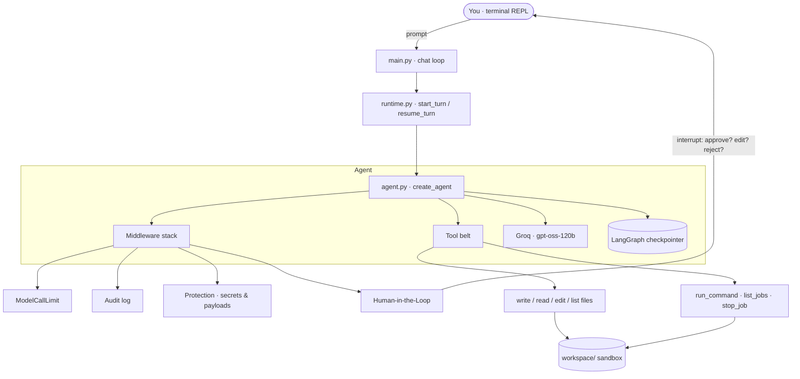

# 🏕️ Cluadecode — the AgCamp Coding Agent

> A terminal-native AI coding agent that reads, writes, and runs **real files and real commands** on your machine — with human approval gates, guardrails, and an audit trail baked in.

Cluadecode is a compact, from-scratch coding assistant in the spirit of Claude Code. You talk to it in a REPL; it plans, calls tools, edits files in a sandboxed workspace, spins up servers, and hands you back a structured summary of everything it touched. It's built on **LangChain 1.x** `create_agent` + **LangGraph**, and runs on **Groq** (`openai/gpt-oss-120b`).

---

## ✨ Why it's interesting

Most "AI writes code" demos stop at generating text. Cluadecode is the plumbing that makes an agent safe to actually *act*:

- **It writes real files** — not code blocks in a chat, actual UTF-8 files on disk.
- **It runs real commands** — foreground shell, or auto-backgrounded servers (Flask, uvicorn, `npm start`) with live logs.
- **It asks before it acts** — a Human-in-the-Loop gate lets you approve / reject / edit every write, edit, and command.
- **It refuses to hurt you** — layered guardrails block secret files, dangerous commands, and unsafe code payloads before they ever execute.
- **It remembers** — LangGraph checkpointing keeps conversation state across turns within a session.
- **It's auditable** — every tool call is appended to a JSON audit log.
- **It's steerable without code** — system behavior lives in editable Jinja prompt templates.

---

## 🧠 Architecture at a glance



**Turn lifecycle:** `main.py` reads your input → `start_turn` invokes the graph → if a tool needs approval the graph **interrupts** and bubbles a decision request up to your terminal → your choice is fed back via `resume_turn` → the agent finishes and returns a **`TurnSummary`** (status, summary, files touched).

---

## 🧩 What's inside

| Area | File(s) | Responsibility |
|------|---------|----------------|
| **Entry point** | `main.py`, `src/main.py` | Interactive REPL, greeting, HITL prompt rendering, turn draining |
| **Runtime** | `src/runtime.py` | Drives the LangGraph agent, parses results, handles interrupts |
| **Agent wiring** | `src/agent.py` | Assembles model + tools + middleware + structured output + memory |
| **Model layer** | `src/models.py` | Provider abstraction (Groq / `ChatGroq`), env-based selection |
| **Memory** | `src/memory.py` | LangGraph `InMemorySaver` checkpointer + per-thread config |
| **Prompts** | `prompts/*.jinja` | System prompt + greeting, editable without touching code |
| **Schema** | `src/schema.py` | `TurnSummary` structured output (Pydantic) |
| **Config** | `src/config/config.py` | Paths, limits, env flags (`HITL_ENABLED`, `WORK_DIR`, …) |

### 🛠️ The tool belt (`src/tools/`)

| Tool | What it does |
|------|--------------|
| `write_file` | Create/overwrite any UTF-8 text file in the workspace |
| `read_file` | Read a file (with size limits) |
| `edit_file` | Exact-substring find-and-replace, language agnostic |
| `list_files` | Walk and list the workspace tree |
| `run_command` | Run bash; foreground for short commands, **auto-background** for servers |
| `list_jobs` | Show background processes + tailed logs |
| `stop_job` | Terminate a background job by PID (graceful → force) |

Supporting modules: `paths.py` (workspace sandboxing + blocked-path patterns), `jobs.py` (background process registry & lifecycle), `text.py` (normalizes escaped newlines, strips stray markdown fences, unescapes HTML).

### 🛡️ The middleware stack (`src/middlewares/`)

Every tool call flows through composable middleware:

1. **`ModelCallLimitMiddleware`** — caps LLM calls per run (default 10) so runaway loops can't burn tokens.
2. **`AuditMiddleware`** — appends a JSON record of every tool call to `.audit_audit.log`.
3. **`ProtectionMiddleware`** — short-circuits calls that target secrets (`.env`, `.git`, keys) or ship dangerous payloads (`os.system`, `eval`, `exec`, `subprocess`, oversized reads).
4. **`HumanInTheLoopMiddleware`** — interrupts writes / edits / commands for your `approve` · `edit` · `reject` decision (read-only tools pass through automatically).

### 🔒 Defense in depth

- **Path sandbox** — every file path is resolved and confined to `workspace/`; escapes are rejected.
- **Blocked paths** — `.env`, `*.key`, `*.pem`, `.git/**`, `*.log`, and friends are off-limits.
- **Blocked commands** — `sudo`, `rm -rf`, `mkfs`, fork bombs, `curl … | sh`, `chmod 777`, etc. are denied.
- **Command rewriting** — `python` / `pip` / `flask` are rewritten to the project's virtualenv interpreter automatically.

---

## 🚀 Quick start

**Prerequisites:** Python 3.12+, [`uv`](https://docs.astral.sh/uv/), and a [Groq API key](https://console.groq.com/).

```bash
# 1. Install dependencies
uv sync

# 2. Configure your environment
echo "GROQ_API_KEY=gsk_your_key_here" > .env

# 3. Run it
uv run python main.py
```

You'll drop into a REPL:

```
Hi! I'm AgCamp coding agent — your personal coding assistant.
I write real files under: /path/to/CluadeCode/workspace
Type 'exit', 'quit', 'q' to stop.
You: create a Flask app with a hello-world route and run it on port 5000
```

The agent will draft the file, pause for your approval, write it, launch the server in the background, and reply with the exact URL to open.

---

## ⚙️ Configuration

All settings are environment variables (via `.env`):

| Variable | Default | Purpose |
|----------|---------|---------|
| `GROQ_API_KEY` | *(required)* | Groq API credentials |
| `HITL_ENABLED` | `true` | Toggle the human-in-the-loop approval gate |
| `WORK_DIR` | `./workspace` | Where the agent is allowed to read/write |
| `MAX_MODEL_CALLS_PER_RUN` | `10` | Per-run LLM call ceiling |
| `MAX_READ_BYTES` | `1000000` | Max bytes read from a single file |

Want to change how the agent thinks? Edit `prompts/system.jinja` — no code changes required.

---

## 💬 Try these

- *"List the files in the workspace."*
- *"Create `greet.js` that exports `greet(name)` returning `Hello, name`."*
- *"Create `Hello.java` that prints Hello, World, then compile and run it."*
- *"Write a Flask app in `app.py` and run it in the background."*
- *"Show me the running jobs."* → *"Stop job 12345."*

---

## 📁 Project layout

```
CluadeCode/
├── main.py                 # root launcher → src/main.py:chat()
├── prompts/                # editable Jinja system & greeting prompts
├── workspace/              # sandbox: everything the agent creates lives here
└── src/
    ├── main.py             # REPL loop + HITL prompt UI
    ├── runtime.py          # turn orchestration & interrupt handling
    ├── agent.py            # LangChain agent assembly
    ├── models.py           # Groq provider layer
    ├── memory.py           # LangGraph checkpointer
    ├── schema.py           # TurnSummary structured output
    ├── messages.py         # message helpers
    ├── jobs.py             # background job manager
    ├── config/             # paths, limits, feature flags
    ├── tools/              # file + shell tools, path sandbox, text utils
    └── middlewares/        # audit, protection, human-in-the-loop
```

---

## 🧱 Built with

**LangChain 1.x** · **LangGraph** · **langchain-groq** · **Pydantic** · **Jinja2** · **Flask** · **uv**

---

## 🗺️ How it compares

Cluadecode is a focused, readable reference implementation of the ideas behind production coding agents — tool use, approval gates, sandboxing, and audit trails — small enough to read end-to-end in an afternoon, but real enough to actually build and run software for you.
